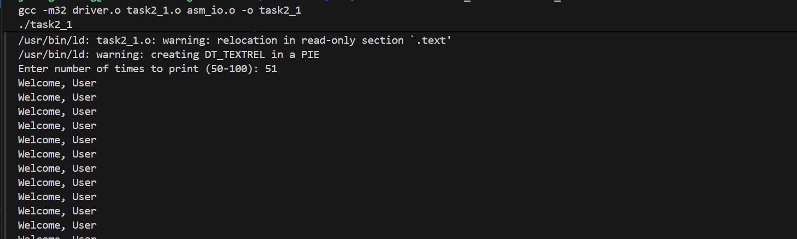
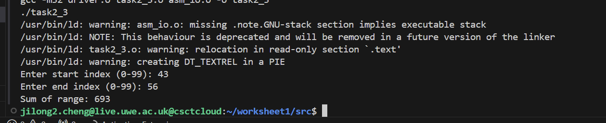

# Worksheet 1 - Operating Systems
## Assembly Programming Tasks

### Task 1: Basic Assembly Programs
**Files:**
- `src/task1.asm` - Basic assembly program
- `src/task1.2.asm` - Extended assembly program

**Description:**
Learning basic assembly language syntax and program structure.

**Screenshots:**


### Task 2: Array Operations
**Files:**
- `src/task2_1.asm` - Array initialization and access
- `src/task2_2.asm` - Array element summation
- `src/task2_3.asm` - Array range summation

**Screenshots:**




### Task 3: Makefile Automation
**File:** `Makefile`

**Description:**
Automated build system using Makefile.

**Build Commands:**
```bash
make all        # Build all programs
make task2_3    # Build specific program
make clean      # Clean build files
